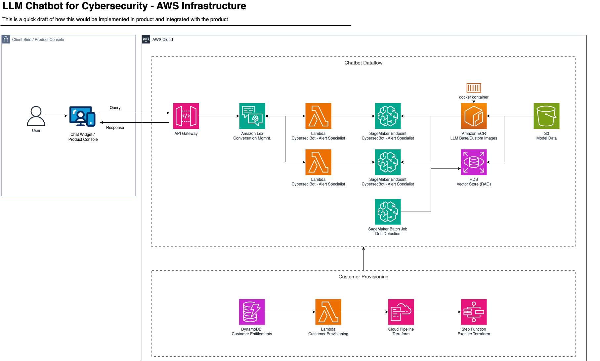

# LLM4Cybersec

This project, LLM4Cybersec aims to create a cybersecurity virtual assistant (Cybersec Bot) that can handle user queries about anything and everything cybersecurity-related, and that can explain causes and effects of specific alerts generated by Endpoint Detection and Response (EDR) tools. The solution integrates Amazon Lex for conversation management, as a kind of front-facing conversationalist/delegator to more specialist models and to serve outputs from these specialist models in a user-friendly way, and Amazon SageMaker for specialized processing of complex EDR alert queries via specialised models such as an alert analyser.

Why LLM4Cybersec? While generalist models have proven very successful in generating responses to all sorts of user queries, and are even able to assist with tasks such as coding, logical reasoning, planning, and many more, they are notoriously poor at domain-specific tasks which require expert-level knowledge, or in fact any task that simply requires context and data on which the LLM is not trained. Indeed, LLMs excel at tasks such as coding and general knowledge questions simply because this forms the majority of the modern internet nowadays, and for more niche tasks, customised models, or fine-tuned models more accurately, are released by companies and open-source contributors alike. In this project, we foresee the need for a cybersecurity specialist model that has been fine-tuned on data from popular sources such as the MITRE ATT&CK framework, the VirusTotal catalogue of malware and process-specific metadata, and actual MDR/security analyst responses to alerts. Such a model will be able to be extended and incorporated into complex systems, such as into a EDR product as a virtual assistant in the UI, much more easily than any out-of-the-box LLM.

In this project, we also explore the addition of retrieval augmented generation (RAG) as a mechanism to reduce hallucination of our Cybersec Bot, to improve the accuracy of the model outputs, and to provide easily referencable sources to users. The necessity of and need for RAG has become fairly prevalent knowledge in the LLM community, and so we won't discuss that further here.

Below you can find explanations of our approach, including architectural overview of a proposed cybersecurity virtual assistant, implementation details of our models, and installation instructions with prerequisites.

## Architecture Overview

1. **Amazon Lex**: Lex manages the conversation and intents.
2. **AWS Lambda**: Lambda is used as a bridge between Lex and SageMaker, i.e. for function calling.
3. **Amazon SageMaker**: SageMaker hosts the fine-tuned LLM for specialised processing using SageMaker Endpoints, and SageMaker Batch Jobs for other services such as user query drift detection and anomaly detection.
4. **Amazon API Gateway**: API Gateway manages incoming requests from the user interface (UI), both from cloud and from on-prem, and forwards requests to Lex and relays responses to back to the UI.
5. **Amazon ECR** ECR hosts our base images, into which we load our model-specific fine-tuned weights for our specialist models.
6. **Amazon S3** S3 is used for all data storage and model weight storage needs.
7. **Amazon RDS** RDS is used to host our RAG vector store.
8. **Amazon DynamoDB** DynamoDB is used to host our customer database and customer entitlement list, which contains information on which customer has which feature enabled/paid for, including access to our cybersecurity virtual assistant, Cybersec Bot.
9. **Amazon Step Functions** Step Functions are used to deploy, via Terraform, new customer infrastructure for Cybersec Bot, once the feature is purchased for the first time. This is done in conjunction with Amazon CloudPipeline. With the same success, it can be done with CloudFormation.
10. **Amazon CloudPipeline** CloudPipeline is used for the same task as with Step Functions above, but serves to implement the Terraform plan. Again, CloudFormation can be used directly as Amazon's native infrastructure-as-code (IaC) rather than hosting custom Terraform.

See the diagram below for more details as to how these services interact in order to realise the proposed deployment solution for Cybersec Bot in AWS.




### Features

- **General Inquiry Handling**: Lex handles general questions and FAQs about cybersecurity.
- **EDR Alert Analysis**: Lex triggers a Lambda function to call a custom SageMaker model for in-depth EDR alert analysis.
- **Scalable and Reliable**: Leveraging AWS services ensures scalability and reliability.

## Project Structure

- `terraform/`: Contains Terraform scripts for provisioning AWS resources.
- `lambda/`: Contains the Lambda function code to integrate Lex with SageMaker.
- `model/`: Contains the code for training, validating, and deploying the SageMaker model.
- `data_drift/`: Contains the code for data drift detection.

## Prerequisites

- AWS CLI configured with appropriate permissions
- Terraform installed
- Python 3.8 or later

## Setup Instructions

### 1. Clone the Repository

```bash
git clone https://github.com/your-repo/cybersecurity-ai-virtual-assistant.git
cd cybersecurity-ai-virtual-assistant
```

### 2. Provision AWS Resources with Terraform

Navigate to the `terraform/` directory and apply the Terraform scripts to provision AWS resources.

```bash
cd terraform
terraform init
terraform apply
```

Naturally, please make sure you have Terraform installed first (see Prerequisites above).

### 3. Deploy the Lambda Function

Navigate to the `lambda/` directory, package the Lambda function, and deploy it.

```bash
cd lambda
zip -r lambda_function_payload.zip .
aws lambda update-function-code --function-name explain_edr_alert --zip-file fileb://lambda_function_payload.zip
```

### 4. Train and Deploy the SageMaker Model

Navigate to the `model/` directory and run the training script.

```bash
cd model
python train_model.py
```

You will likely be unable to run this directly on your personal machine, owing to compute restrictions - depending on the type of model you choose, should you choose to experiment with smaller models than the defaults here, of course. As a result, it is recommended to use a SageMaker Notebook Instance with the necessary compute (e.g. a ml5.4xlarge instance) to train the models, or a locally-hosted GPU cluster, or HCP centre, that your organisation may have.

#### 4.1. Data Preparation - Instruct Model Training

##### 4.1.1 Raw Data

Ensure your data is in a format suitable for training the model. The data should be a list of dictionaries containing 'instruction' and 'response' pairs.

Here is an example of the expected data format:

```json
[
    {"instruction": "Explain this EDR alert: suspicious email attachments detected.", "response": "This alert indicates a potential phishing attempt characterized by suspicious email attachments."},
    {"instruction": "What is the significance of this alert on system security?", "response": "The alert suggests that there may be unauthorized access attempts, potentially leading to data breaches."}
]
```

As you can see, it is a list of JSON objects. Save this data to a JSON file, for example, training_data.json.

##### 4.1.2 Upload Data to S3

If working with AWS, using a SageMaker Notebook Instance or other resource for training, upload your training data to an S3 bucket. You can use the AWS CLI for this, e.g.,

```bash
aws s3 cp training_data.json s3://your-bucket/training_data.json
```

##### 4.1.3 Run the Training Script

Navigate to the `src/models/cybersecbot/cybersecllm` directory and run the training script, providing the S3 path to your training data as an argument.

```bash
cd src/models/cybersecbot/cybersecllm
python llm4cybersecurity.py --train_bucket_s3_path <your-bucket> --train_data_s3_path <s3-path>/training_data.json
```

### 5. Data Drift Detection

We also provide a module for data drift detection, for anomalous user queries (i.e. queries not encountered thus far that deviate substantially from training dataset distribution), and for systemic user query deviation from the training dataset distribution. Navigate to the `src/models/datadriftdetector/` directory and run the data drift detection script:

```bash
cd src/models/datadriftdetector/detector
python datadriftmodel.py --user_validation_bucket_s3_path <your-bucket> --user_validation_data_s3_path <s3-path>/user_validation_data.json
```

### 6. Example Usage

#### 6.1 General Inquiry
User: "What is an EDR?"
Lex: "EDR stands for Endpoint Detection and Response. It is a cybersecurity technology that monitors end-user devices to detect and respond to suspicious activities and threats."

#### 6.2 EDR Alert Analysis
User: "Explain this EDR alert: suspicious email attachments detected."
Lex: Triggers Lambda function to call the SageMaker model.
Lambda: Calls the SageMaker model and processes the response.
Lex: "This alert indicates a potential phishing attempt characterized by suspicious email attachments."

#### 6.3 Configuration Details
Amazon Lex Bot: Handles conversation management and intent recognition.
AWS Lambda Function: Bridges Lex with SageMaker for specialized processing.
Amazon SageMaker Model: Fine-tuned LLM for explaining EDR alerts.

#### 6.4 File Descriptions
terraform/main.tf: Main Terraform script to provision AWS resources.
lambda/lambda_function.py: Lambda function code to handle Lex requests and call SageMaker.
model/train_model.py: Script to train, validate, and deploy the SageMaker model.
data_drift/detect_drift.py: Script for detecting data drift in customer queries.

### 7. Contributing
Contributions are welcome. Please submit a pull request or open an issue.

### 8. License
This project is licensed under the MIT License. See the LICENSE file for more details.
